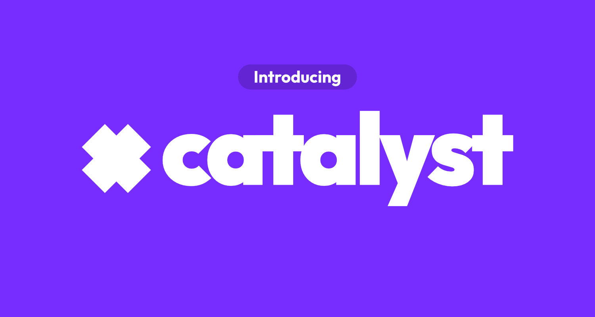

# Catalyst

[](LICENSE)
[](#installation)
[](https://www.electronjs.org/)

Catalyst is a desktop manager for Minecraft servers. It helps you create, run, configure, back up, and monitor multiple servers from one Windows app.

## Highlights

- Manage multiple Vanilla, Paper, Fabric, Forge, and Purpur servers
- Download and select the right Java runtime for each Minecraft version
- Use a built-in live console for server output and commands
- Search and install plugins from Modrinth
- Track TPS, memory, player activity, and events with CatalystAnalytics
- Schedule backups for worlds and server files
- Edit server settings, whitelist, and ban list from the UI
- Share a server through the built-in ngrok integration

## Installation

Download the latest Windows installer from [GitHub Releases](../../releases).

| Platform | Status | Format |
| --- | --- | --- |
| Windows | Supported | `.exe` installer |
| Linux | Planned | Not available yet |

## Development

### Requirements

- [Node.js](https://nodejs.org/) 20 or newer
- npm, included with Node.js
- Windows for packaged desktop builds

### Setup

```bash
npm install
npm run dev
```

The dev command starts the Electron app and the renderer dev server.

If `npm run dev` fails with `Error: spawn EPERM`, your terminal, antivirus, or sandbox may be blocking Node from starting the esbuild/Electron child process. Run the same command from a normal trusted terminal and allow Node/Electron when Windows or your antivirus asks.

### Build

```bash
npm run build:win
```

For an unpacked local build:

```bash
npm run build:unpack
```

### Checks

```bash
npm run typecheck
npm run test:unit
npm run coverage
```

## CatalystAnalytics

The desktop app ships with `resources/plugins/CatalystAnalytics.jar`. When analytics are enabled for a Paper or Purpur server, Catalyst copies the plugin into the server's `plugins/` directory and keeps it installed on future starts.

The plugin exposes a local REST API for dashboard data such as TPS, memory usage, joins, leaves, play time, chat counts, commands, kills, deaths, and approximate player location. Plugin details live in [catalyst-plugin/README.md](catalyst-plugin/README.md).

## Tech Stack

| Area | Tools |
| --- | --- |
| Desktop | Electron 33, electron-vite |
| UI | React 19, Tailwind CSS, shadcn/ui |
| Language | TypeScript |
| Charts and visuals | Recharts, Three.js |
| Testing | Vitest, Testing Library |

## License

Catalyst is licensed under the [GNU General Public License v3.0](LICENSE).
