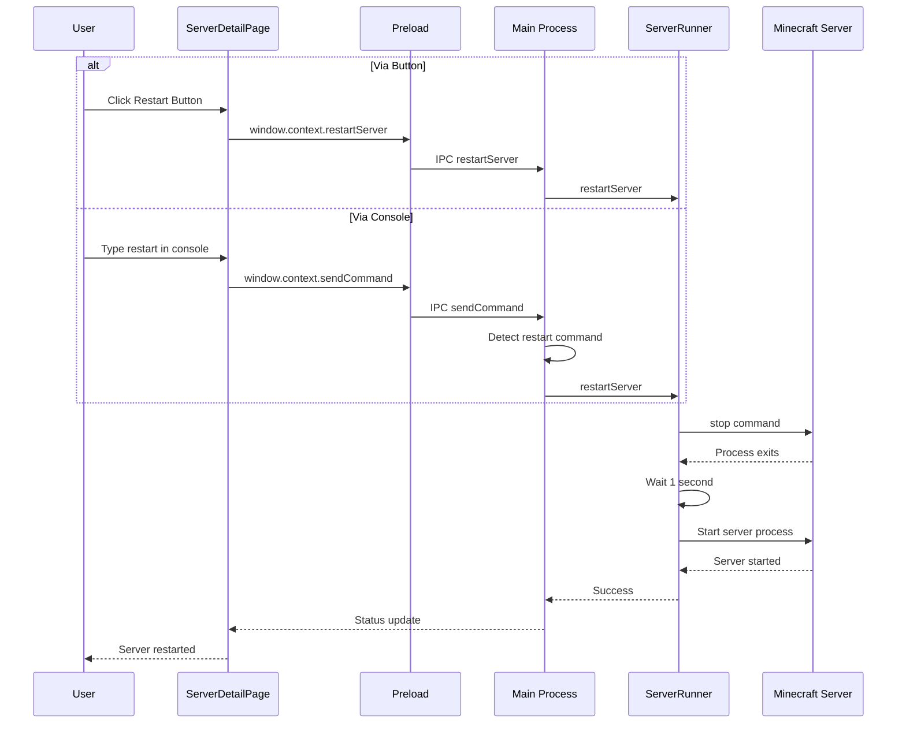

# Server Restart Functionality Plan

## Overview

The user wants the `restart` command to work properly in the console, and also wants a restart button next to the start/stop button in the UI. Currently, the restart command only works on Linux via start.sh scripts, but we need to make it work on all platforms by intercepting it in the application.

## Current Architecture

### Key Files

1. **`src/main/lib/server-runner.ts`**
   - [`startServer()`](src/main/lib/server-runner.ts:358) - Starts a server process
   - [`stopServer()`](src/main/lib/server-runner.ts:476) - Stops a server gracefully
   - [`sendCommand()`](src/main/lib/server-runner.ts:505) - Sends commands to server stdin

2. **`src/main/index.ts`**
   - IPC handlers for startServer, stopServer, sendCommand

3. **`src/preload/index.ts`**
   - Exposes IPC methods to renderer

4. **`src/renderer/src/pages/ServerDetailPage.tsx`**
   - [`handleStart()`](src/renderer/src/pages/ServerDetailPage.tsx:435) - Start button handler
   - [`handleStop()`](src/renderer/src/pages/ServerDetailPage.tsx:575) - Stop button handler
   - UI buttons at lines 1247-1262

## Implementation Plan

### Step 1: Add restart function in server-runner.ts

Create a new `restartServer()` function that:
1. Calls `stopServer()` to gracefully stop the server
2. Waits for the server to fully stop
3. Calls `startServer()` to start it again

```typescript
export async function restartServer(
  serverId: string,
  mainWindow: BrowserWindow
): Promise<{ success: boolean; error?: string }> {
  // Check if server is running
  if (!runningServers.has(serverId)) {
    return { success: false, error: "Server is not running" };
  }

  // Stop the server
  const stopResult = await stopServer(serverId);
  if (!stopResult.success) {
    return { success: false, error: stopResult.error || "Failed to stop server" };
  }

  // Wait a moment for cleanup
  await new Promise(resolve => setTimeout(resolve, 1000));

  // Start the server again
  return startServer(serverId, mainWindow);
}
```

### Step 2: Intercept restart command in sendCommand()

Modify [`sendCommand()`](src/main/lib/server-runner.ts:505) to detect the "restart" command and handle it specially:

```typescript
export function sendCommand(serverId: string, command: string): void {
  const child = runningServers.get(serverId);
  if (child && child.stdin && !child.stdin.destroyed) {
    // Check for restart command - we need special handling
    if (/^\s*restart\s*$/i.test(command)) {
      // Don't send restart to server - it won't work properly
      // Instead, emit an event that the main process will handle
      // This will be handled via a separate restartServer IPC call
      return;
    }
    
    if (/^\s*(tps|memory)\s*$/i.test(command)) {
      userStatsBypassUntil.set(serverId, Date.now() + 6000);
    }
    child.stdin.write(command + "\n");
  }
}
```

**Note:** The restart command interception needs to happen at a higher level since we need access to the BrowserWindow. We'll handle this in the IPC handler.

### Step 3: Add IPC handler in index.ts

Add a new IPC handler for restart:

```typescript
ipcMain.handle("restartServer", async (_event, id: string) => {
  const mainWindow = BrowserWindow.getAllWindows()[0];
  if (!mainWindow) {
    return { success: false, error: "No window available" };
  }
  return restartServer(id, mainWindow);
});
```

Also modify the sendCommand handler to intercept restart:

```typescript
ipcMain.handle("sendCommand", async (_event, id: string, command: string) => {
  // Intercept restart command
  if (/^\s*restart\s*$/i.test(command)) {
    const mainWindow = BrowserWindow.getAllWindows()[0];
    if (!mainWindow) {
      return { success: false, error: "No window available" };
    }
    return restartServer(id, mainWindow);
  }
  sendCommand(id, command);
});
```

### Step 4: Expose restartServer in preload

Add to [`src/preload/index.ts`](src/preload/index.ts:76):

```typescript
restartServer: (id: string) => ipcRenderer.invoke("restartServer", id),
```

### Step 5: Add restart button in ServerDetailPage.tsx

Add a restart button next to the start/stop buttons:

```tsx
{/* Restart button - only show when server is online */}
{server?.status === "Online" && (
  <Button
    variant="outline"
    size="sm"
    className="h-8 gap-2"
    onClick={handleRestart}
    disabled={restarting}
  >
    {restarting ? (
      <Spinner className="h-4 w-4" />
    ) : (
      <RefreshCw className="h-4 w-4" />
    )}
    Restart
  </Button>
)}
```

Add state and handler:

```typescript
const [restarting, setRestarting] = useState(false)

const handleRestart = async () => {
  if (!id) return
  setRestarting(true)
  setError(null)
  const result = await window.context.restartServer(id)
  if (!result.success) {
    setError(result.error || "Failed to restart server")
  }
  setRestarting(false)
}
```

### Step 6: Update type definitions

Add the restartServer method to the window.context interface in [`src/preload/index.d.ts`](src/preload/index.d.ts).

## Flow Diagram



## Files to Modify

1. `src/main/lib/server-runner.ts` - Add `restartServer()` function
2. `src/main/index.ts` - Add IPC handler for restart, intercept restart in sendCommand
3. `src/preload/index.ts` - Expose `restartServer` method
4. `src/preload/index.d.ts` - Add type definition
5. `src/renderer/src/pages/ServerDetailPage.tsx` - Add restart button and handler

## Testing Checklist

- [ ] Restart button appears only when server is online
- [ ] Restart button shows loading state during restart
- [ ] Console command "restart" triggers restart
- [ ] Server stops gracefully before restart
- [ ] Server starts again after stop
- [ ] Error handling works correctly
- [ ] Works on Windows, macOS, and Linux
